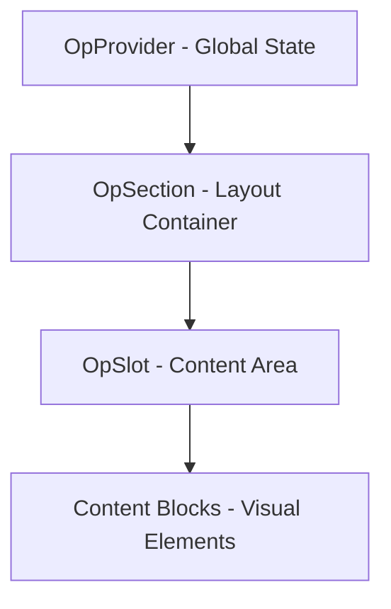

The Mindmap Architecture defines how OpenPress organizes data, logic, and presentation. It follows a hierarchical "Node & Branch" pattern that ensures scalability and clean separation of concerns.

## Core Concepts

OpenPress is structured into four distinct layers:

### 1. The Schema Layer (`@openpress/schemas`)
The "Source of Truth". Every piece of data—from a single text block to a full site configuration—is validated using **Zod**. This ensures type safety across the entire monorepo.

### 2. The UI Engine (`@openpress/ui`)
The "Nervous System". This layer manages the context tree, providing state (Page, Site, Mode) to every component. It handles the rendering of sections and slots without being tied to a specific design.

### 3. The Feature Layer (`@openpress/feature-*`)
The "Capabilities". Modular packages that add specific functionality, such as the **Media Library**, **Booking System**, or **Contact Forms**. Features are decoupled and can be plugged into any OpenPress instance.

### 4. The Theme Layer (`@openpress/theme-*`)
The "Visual Identity". Themes provide the CSS classes and visual rules using the **Liquid Glass** token system.

## Hierarchical Flow

The architecture follows a strict downward flow:

- **OpProvider**: Orchestrates the global environment.
- **OpSection**: Defines a semantic region of a page (e.g., Hero, Features).
- **OpSlot**: A named container within a section that holds an ordered list of blocks.
- **Blocks**: The final nodes in the tree (e.g., RichText, Image, Button).

## Why Mindmap?

- **Modular**: Swap features or themes without touching the core engine.
- **Predictable**: Data flows clearly from top to bottom.
- **Extensible**: Add new "branches" (features) easily.
